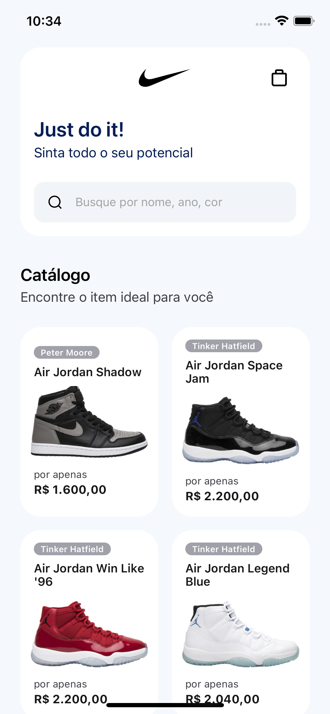
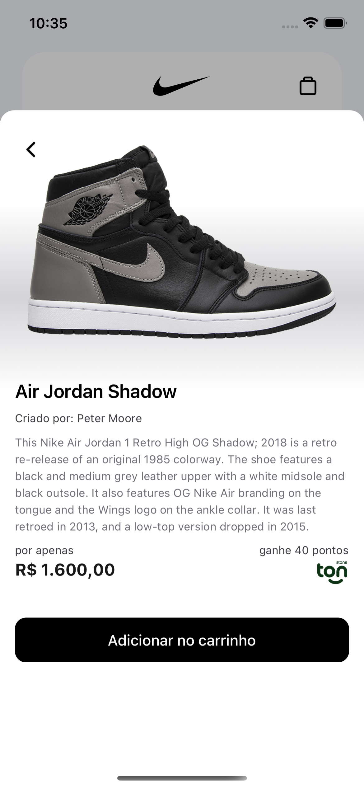
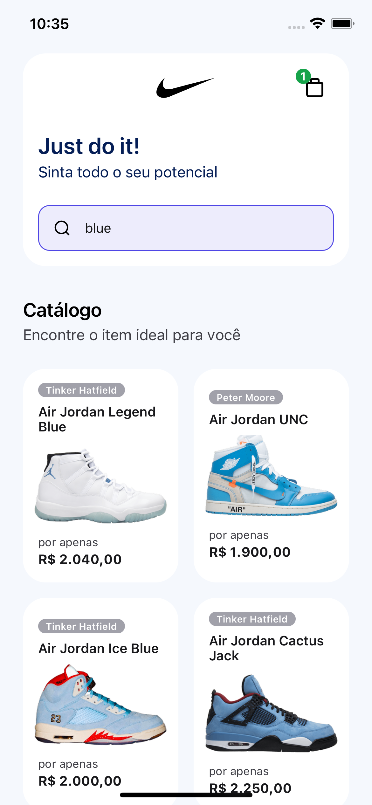
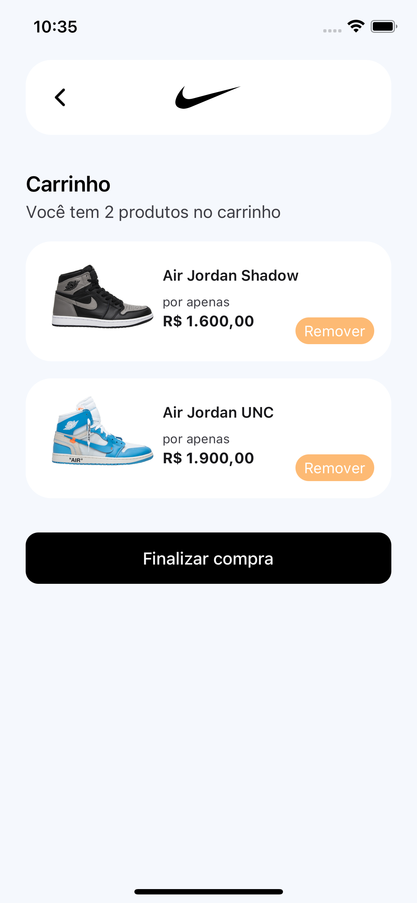
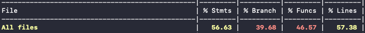

# Nike Catalog

*Last APK*: https://expo.dev/artifacts/eas/f7fCzo7ciX37DLqhc5ftBM.apk

___

## Stack

> Typescript<br>
> React<br>
> React Native<br>
> Expo<br>
> Native Base<br>
> Axios<br>
> React Query<br>
> Jest + Testing Library<br>
> Jotai<br>
> React Navigation


## Challenge requirements

- Use of typescript
- Unitary tests
- Consuming an external API
- state management
- Excess management
- Organizational and structural architecture

___
| initial page | product details | search | cart |
|---|---|---|---|
|||||

## Scope of use

I created a high-end Nike sneakers store. Where we are listing the items on the home page, viewing the details and adding to the cart.
I created a fake API using MockAPI. We are listing and searching using this API.
To manage state I used Jotai, as it is small and simple to use. As there is not such a need for control, it was a quick choice.
I did basic tests, just to understand how I do my tests. We have lint and prettier to target a code pattern. I used Expo to be fast and have a development environment that was easy to install and test. It includes the Native-base so that the process of creating components was fast, because the challenge needed to be delivered in 3 days and my time is short lol.

___

## Improvement points

Pin header to top. I believe I can improve this project by including more tests. Tweaking the UI of some components. Inserting storybook to document my components. Including a global error handler like Sentry.

___

## Runing project

We are using expo to manage the environments. So to run the project is simple. With the simulator open, run the command:

Add in your `.env`

```bash
API_BASE_URL=https://5b67c708f793e00014562619.mockapi.io/api
```

install the dependencies

```bash
yarn
```

ios

```bash
yarn ios
```

android

```bash
yarn android
```

physical device with expo app installed

```bash
yarn start
```

___

## Tests

The project has test coverage. Today the number we have is about 50% of code coverage, a lot is given to typescript, the project development structure and obviously the code tests developed. Even so, it is not a number that deserves so much relevance because it can be misleading.

_Remembering that it was created only simple tests due to time._



```bash
yarn test
```

coverage

```bash
yarn test:coverage
```
___

### Utils

- [Testing Library](https://testing-library.com/)
- [Jest](https://jestjs.io/)
- [MockAPI](https://mockapi.io/)
- [React Query](https://react-query-v3.tanstack.com/)
- [Jotai](https://jotai.org/)
- [NativeBase](https://nativebase.io/)
